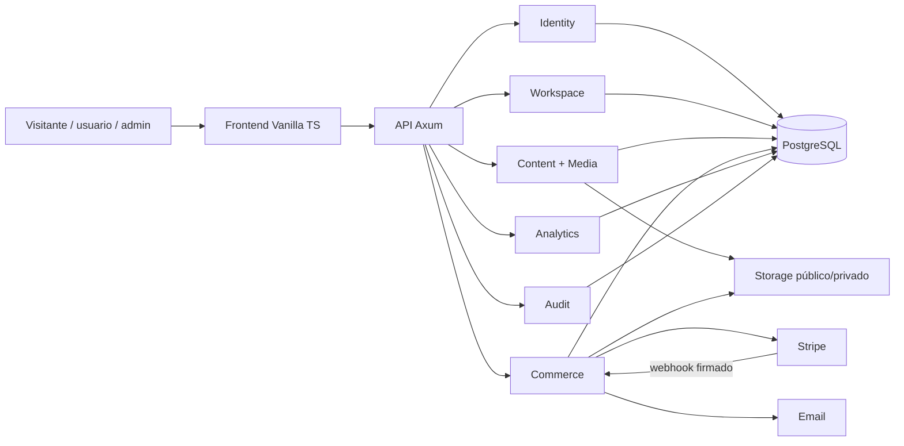

# Manual de arquitectura de wandori.us

> **Fecha:** 2026-07-29  
> **Estado:** arquitectura objetivo aprobada como base; implementación pendiente  
> **Autoridad:** fuente canónica técnica del proyecto  
> **Plan ejecutable:** `Agente/planes/plan-escritorio-persistente-cuentas-admin-apps-2026-07-29.md`

## 1. Cómo leer este documento

- **Actual:** comportamiento que existe hoy y debe tratarse como deuda o punto de migración.
- **Objetivo:** contrato que debe respetar la implementación final.
- **Transición:** compatibilidad permitida mientras se migra.
- **Decisión pendiente:** no se implementa el área afectada hasta resolverla y registrarla.

Los planes indican orden y checklists. Este manual define límites, invariantes y contratos. El manual visual define la apariencia. Si un plan contradice este documento, se corrige el plan antes de programar.

## 2. Producto y principios

wandori.us es un blog, portfolio y tienda digital presentado como un sistema operativo monocromo interactivo. La navegación exterior permanece fuera del OS; el OS ocupa la columna de contenido disponible.

Principios no negociables:

1. El escritorio es una interfaz; artículos, proyectos, productos y media siguen siendo datos de dominio.
2. Toda creación editorial o comercial nace privada y en borrador.
3. El backend autoriza cada operación; ocultar una aplicación no concede seguridad.
4. El workspace guarda referencias estables, nunca HTML, funciones, comandos ni rutas ejecutables.
5. El release público es inmutable; el visitante modifica un overlay propio.
6. Las ventanas comparten un solo chrome y un solo gestor.
7. Los pagos se confirman mediante webhook verificado e idempotente.
8. Los descargables de pago nunca viven en almacenamiento público.
9. Analytics de producto y auditoría administrativa son dominios distintos.
10. La arquitectura crece por necesidades comprobadas, no por imitar un kernel completo.

## 3. Estado actual y bloqueos

### Frontend actual

- Vanilla TypeScript + Vite.
- `frontend/src/main.ts`, `router.ts` y `store.ts` concentran el arranque, navegación y estado.
- El escritorio en `features/desktop/desktop-concept.ts` es un concepto parcialmente navegable.
- Finder y Reader son previews; no existe todavía gestor real, persistencia, drag/resize ni taskbar derivada.
- Admin y Settings superan los límites de responsabilidad.
- El JWT está en `localStorage` y existen credenciales/auto-registro de desarrollo en el bundle.
- Los tipos API son manuales y Orval no está alineado aún con Fetch + `tags-split`.

### Backend actual

- Axum + SQLx + PostgreSQL, organizado nominalmente en handlers, services y repositories.
- Cualquier usuario autenticado alcanza operaciones consideradas administrativas.
- CORS permite cualquier origen.
- Endpoints públicos pueden exponer borradores/media privada.
- `/uploads` sirve binarios de forma pública.
- Comercio contiene SQL y coordinación directamente en handlers/webhook, con resultados ignorados.
- OpenAPI no representa todavía toda la API real.

### Bloqueos de salida pública

- Registro público deshabilitado hasta completar roles, capacidades y sesiones revocables.
- Compra deshabilitada hasta aislar entregables, retirar modo demo y verificar webhook/idempotencia.
- Publicación de workspace deshabilitada hasta validar esquema, recursos, geometría y revisión optimista.

## 4. Arquitectura de contexto



Límites de confianza:

- Navegador: no confiable para rol, precio, estado de pago, visibilidad o ruta de archivo.
- API: valida input, capacidad, transición y concurrencia.
- Proveedor de pago: fuente externa; solo eventos con firma y contenido esperado modifican órdenes.
- Storage privado: solo accesible mediante servicio autorizado o grant corto.

## 5. Arquitectura frontend

### 5.1 Núcleos mínimos

1. `MountedView`: ciclo de vida, abort y teardown.
2. `AppRegistry`: catálogo local y único de programas.
3. `WindowManager`: reducer/store de instancias y geometría.
4. `CommandRegistry`: acciones disponibles por contexto/capacidad.
5. `RouteAppAdapter`: URL pública ↔ aplicación + recurso.
6. `AnalyticsDispatcher`: eventos tipados, sin conocimiento visual.

La presentación es intercambiable:

- Desktop/tablet: WindowManager proyecta apps dentro de ventanas.
- Móvil: MobileAppStack proyecta las mismas apps a pantalla completa desde un launcher.

No existen versiones móviles de las apps ni un segundo store de dominio.

No se añade contenedor de dependencias, bus global genérico, microfrontend ni framework de procesos.

### 5.2 Ciclo de vida

```ts
interface RenderContext {
    signal: AbortSignal;
}

interface MountedView {
    element: HTMLElement;
    destroy?(): void;
}
```

- Router y WindowManager abortan el contexto anterior antes de desmontar.
- Listeners globales usan `AbortSignal` o teardown explícito.
- Abort esperado no muestra error; toda otra falla produce feedback visible y logging útil.
- Una app devuelve contenido; nunca crea su propia ventana.

### 5.3 Registro de aplicaciones

El `AppRegistry` local define ID, título, icono Lucide, modo singleton/recurso, capacidades y factory de contenido. Es la única fuente para Aplicaciones, iconos de programas, títulos, taskbar y reglas de apertura.

`GET /api/bootstrap` no envía código ni manifiestos ejecutables. Devuelve sesión, capacidades, feature flags, release y overlay. El registry local filtra por capacidades recibidas.

### 5.4 Ventanas

```text
App content -> WindowManager -> DesktopWindow compartida -> taskbar derivada
```

- El array de ventanas define z-order; una sola instancia está activa.
- Comandos puros: open, focus, minimize, restore, close, move y resize.
- Bounds se validan y reencuadran.
- Ninguna app define z-index, chrome, drag, resize o controles propios.
- Taskbar es una proyección del store, nunca una lista mantenida manualmente.

En móvil `<768px` no se monta `DesktopWindow`, barra superior ni taskbar. `MobileLauncher` y `MobileAppStack` consumen el mismo AppRegistry, MountedView, comandos, rutas y recursos. Tablet conserva el modelo de ventanas.

### 5.5 Rutas y SEO

- Toda entidad pública posee URL canónica estable.
- Deep links abren el shell y la aplicación correcta mediante `RouteAppAdapter`.
- `history` solo se modifica desde router/adaptador.
- **Decisión previa obligatoria:** elegir HTML semántico servido/prerenderizado para rutas públicas como base indexable y usar el OS como mejora progresiva, o documentar una alternativa con evidencia equivalente. Una SPA cliente por sí sola no cierra SEO.

### 5.6 Dependencias permitidas

```text
UI -> tipos/comandos
apps -> servicios de dominio + tipos/comandos
desktop shell -> registry + window store + command registry
route adapter -> router + comandos desktop
stores -> funciones puras + adaptadores de persistencia
API generated -> nunca importa UI
```

Prohibido:

- Fetch directo desde componentes.
- SQL o reglas de capacidad en frontend.
- Apps que importen internals del WindowManager.
- Listas paralelas de programas/ventanas.
- `innerHTML` con datos sin el sanitizador central.
- Tipos generados editados manualmente.

## 6. Workspace y sistema de archivos

### 6.1 Capas

```text
release público inmutable
          + overlay personal versionado
          + estado efímero de sesión
          = escritorio visible
```

- Admin personal y Organizar inicio público son workspaces distintos.
- Invitado persiste overlay pequeño localmente.
- Usuario sincroniza overlay en servidor.
- Al iniciar sesión se elige explícitamente importar local, usar remoto o restablecer.

### 6.2 Nodos y recursos

Un nodo pertenece al workspace:

```ts
type WorkspaceNodeKind = 'app' | 'folder' | 'resource' | 'shortcut';
type WorkspaceNodeOrigin = 'release' | 'overlay';
type WorkspaceNodeLifecycle = 'active' | 'trashed';
```

Un recurso pertenece al catálogo editorial/comercial:

```ts
type ResourceKind = 'article' | 'project' | 'media' | 'product' | 'asset';
type EditorialState = 'draft' | 'ready';
type Visibility = 'private' | 'public' | 'unlisted';
type ResourceLifecycle = 'active' | 'trashed';
```

- Carpetas son nodos, no recursos editoriales.
- Un recurso puede tener varias referencias con `instanceId` distintos.
- Copiar duplica referencia; cortar mueve la misma instancia; duplicar contenido es otro comando.
- Mover no cambia visibilidad, título editorial, precio ni propiedad.
- IDs de overlay usan namespace/UUID estable y se conservan al sincronizar.
- Backend rechaza ciclos, profundidad/tamaño excesivos e IDs no autorizados.

### 6.3 Papelera

- Papelera personal: tombstones del overlay; vaciar no toca servidor público.
- Papelera del layout: nodos retirados del draft/release; vaciar elimina referencias.
- Papelera de recursos: soft delete administrativo con restauración, retención, confirmación y auditoría.
- Resolver público normal exige nodo activo + recurso público/activo.
- Resolver Papelera pública solo muestra metadata de referencias explícitamente publicadas y nunca permite compra/descarga.

### 6.4 Merge y concurrencia

- Releases inmutables; drafts/overlays llevan `revision`.
- Escritura envía `expectedRevision`; conflicto devuelve `409` y estado actual.
- Merge por `instanceId` y campo.
- Recursos retirados y permisos vencidos ganan sobre preferencias.
- No se usa CRDT ni event sourcing para este alcance.

## 7. Modelo de recursos

`resources` es un sobre común con ID, tipo, título de sistema, estado editorial, visibilidad y lifecycle. Las tablas tipadas almacenan cuerpos, precios y metadata específica.

- `articles`: incluye About como artículo con alias de sistema `about`.
- `projects`: descripción y destino permitido para Navegador retro.
- `media`: preview público o asset editorial, con MIME real y procesamiento.
- `products`: catálogo independiente; un artículo o carpeta lo referencia, pero no lo posee.
- `assets`: binarios y estado `processing|clean|rejected`; entregables privados separados de previews.

Defaults de base de datos y servicio: `draft`, `private`, `active`; producto además `inactive`.

## 8. Backend por dominios

Dominios objetivo:

- `identity`: usuarios, sesiones, capacidades y recuperación.
- `workspace`: drafts, releases, overlays y merge.
- `content`: artículos, About y proyectos.
- `media`: upload, validación, derivados y storage.
- `commerce`: productos, órdenes, pagos, entitlements y descargas.
- `analytics`: eventos de producto y agregados.
- `audit`: historial administrativo inmutable.

Flujo obligatorio:

```text
handler -> service/application command -> repository -> PostgreSQL/storage/provider
```

- Handler valida transporte y extrae actor; no contiene SQL ni orquesta transacciones complejas.
- Service valida capacidad y transición, controla transacción/outbox y devuelve resultado tipado.
- Repository encapsula SQLx preparado/tipado.
- Proveedor externo se integra mediante adaptador.
- Operaciones críticas nunca retornan `void` ni silencian errores.

## 9. Identidad y autorización

- Registro público siempre crea rol `user`; el request nunca acepta rol.
- Admin se crea/promueve mediante bootstrap server-side auditado.
- Sesiones opacas revocables en cookie `HttpOnly`, `Secure`, `SameSite=Lax`.
- Token aleatorio se guarda hasheado; rotación, expiración, cierre y revocación.
- CSRF/origin checks para mutaciones, rate limit y respuestas no enumerables.
- Verificación de email y recovery; MFA/passkey obligatorio para admin antes de producción.
- Separar rutas `/api/public`, `/api/me`, `/api/admin` y `/api/webhooks`.
- Cada endpoint admin exige capacidad server-side explícita.

## 10. Comercio y entrega digital

### Datos

- `products`: catálogo, visibilidad y estado comercial.
- `product_versions`: entregable inmutable; reemplazar archivo crea versión.
- `orders` y `order_items`: importe/moneda/nombre versionados al comprar.
- `payment_events`: `provider_event_id UNIQUE` y procesamiento observable.
- `entitlements`: derecho del comprador a una versión.
- `download_grants`: token hasheado, corto, revocable y de uso limitado.

### Flujo

1. Compra pide producto público/activo al backend.
2. Servidor calcula precio y crea orden idempotente.
3. Payment Element vive dentro del OS cuando el proveedor lo permite; redirección controlada es fallback.
4. Solo webhook con firma, importe, moneda y producto válidos marca pago.
5. Transacción concede entitlement y outbox agenda email/fulfillment.
6. Descarga revalida comprador/claim, orden, entitlement y grant.
7. Nunca se expone `storage_key`, `download_path` o URL permanente.

Compra invitada usa email verificado y claim secreto hasheado; conocer UUID de orden no concede acceso. Reembolso/contracargo puede revocar nuevas descargas y siempre se audita.

## 11. Analytics y auditoría

- Evento analítico: ID único, schema version, nombre allowlisted, sesión, app/ventana/target, outcome y propiedades limitadas.
- Cliente informa intención/navegación; servidor confirma auth, pago, publicación, entitlement y entrega.
- Batch transaccional con límites, rate limit, backoff y retención.
- Nunca registrar texto copiado, contenido escrito, email, token, URL firmada ni datos de pago.
- Estadísticas consulta agregados, no escanea indefinidamente eventos crudos.
- `audit_log` registra actor, acción, recurso, request ID y transición administrativa; no sustituye analytics.

## 12. Contratos API

- DTO público y DTO admin separados.
- Errores con código estable, mensaje seguro, request ID y detalles de validación permitidos.
- `409` para revisión optimista; `Idempotency-Key` para creación de orden y comandos repetibles.
- Public endpoints imponen publicación/visibilidad server-side sin filtros que la desactiven.
- OpenAPI describe toda ruta consumida; Orval genera Fetch en modo `tags-split`.
- El cliente API devuelve `Result` común y maneja expiración de sesión sin enmascarar fallos.

## 13. Datos y migraciones

Tablas objetivo mínimas:

```text
users, auth_sessions
resources, articles, projects, media/assets
workspace_drafts, workspace_releases, user_workspace_overlays, user_preferences
products, product_versions, orders, order_items
payment_events, entitlements, download_grants, outbox
analytics_events, audit_log
```

- Constraints y defaults refuerzan privacidad, estados válidos y unicidad.
- Migraciones de dominio usan expand → migrate/backfill → switch → contract.
- No borrar columnas/rutas legacy hasta verificar paridad y rollback.
- Secretos, tarjetas, tokens en claro y rutas privadas nunca se almacenan en DTOs públicos ni logs.

## 14. Flujos de referencia

### Publicar inicio

Admin entra al sandbox → edita draft con revisión → preview visitante → backend valida recursos/geometría → transacción crea release inmutable → bootstrap entrega nueva release.

### Publicar recurso

Editor crea privado/draft → guarda → valida → acción explícita cambia visibilidad → auditoría registra transición → resolvedores públicos lo incluyen solo si el nodo también es visible.

### Login y sincronización

Cuenta autentica → rota sesión → detecta overlay local/remoto → usuario elige fuente → merge por IDs/revisión → conflicto visible, nunca overwrite silencioso.

### Papelera

Comando distingue nodo/recurso → soft delete en capa correcta → restauración conserva referencia/visibilidad previa → purga admin respeta retención, referencias, compras y auditoría.

### Compra

Producto → orden idempotente → proveedor → webhook verificado → entitlement → recibo/descarga autorizada → email secundario.

## 15. SEO, rendimiento y accesibilidad

- Rutas públicas deben entregar título, canonical, Open Graph y Schema.org sin depender de abrir manualmente una app.
- Sitemap solo incluye recursos públicos/activos.
- Aplicaciones pesadas se cargan dinámicamente cuando exista beneficio medido. La política vigente es `registerLazy` para apps grandes, WASM, WebGL, media avanzada o dependencias pesadas; no existe todavía `preload`/`heavy` global. `MountedView.destroy()` y `AbortSignal` deben liberar workers, timers, object URLs, audio y GPU. La decisión detallada y el presupuesto vigente están en `Agente/documentacion/arquitectura/adr-carga-apps-pesadas-2026-07-31.md`.
- Bootstrap combina sesión/capacidades, feature flags, release y overlay en un roundtrip razonable.
- Navegación completa por teclado, foco recuperable, zoom 200% y ventanas reencuadradas.
- Breakpoints mínimos: 320, 768 y 1024. Móvil usa launcher + apps full-screen y `mobilePosition` (3/2 columnas); `mobileOrder` solo es fallback legacy. Tablet/desktop usan ventanas, `position` y bounds.

## 16. Pruebas y quality gates

- Unitarias: reducers, merge, geometría, transiciones y comandos.
- Integración DB: capacidad, publicación, concurrencia, webhook, entitlement y purga.
- Contrato: OpenAPI/Orval, DTO público sin campos privados.
- DOM: lifecycle, cleanup, menú, taskbar y teclado.
- E2E críticos: visitante, cuenta, admin, publicar, comprar, descargar, reembolsar y restaurar.
- Casos negativos obligatorios: escalada de rol, draft público, precio manipulado, webhook duplicado, descarga ajena y papelera fuera de capa.
- Sentinel/VarSense/self-check bloquean regresiones cuando el baseline quede limpio.

## 17. Estrategia de migración

1. Resolver ADRs bloqueantes: SEO, storage privado y modalidad Stripe.
2. Cerrar exposición: roles/capacidades, filtros públicos, uploads y modo demo.
3. Implantar sesiones y Cuenta.
4. Introducir lifecycle, AppRegistry, WindowManager y CommandRegistry.
5. Añadir catálogo de recursos mediante expand/migrate/contract.
6. Implementar workspace draft/release/overlay.
7. Extraer programas editoriales del Admin legado.
8. Construir comercio seguro.
9. Tipar analytics y crear Estadísticas.
10. Verificar paridad y retirar `/admin`, JWT, DTO/rutas legacy y CSS huérfano.

## 18. Decisiones pendientes obligatorias

- **ADR-001 SEO:** HTML servido/prerender/progressive enhancement.
- **ADR-002 storage:** proveedor y política de binarios privados, derivados y backups.
- **ADR-003 pago:** Payment Element, fallback de redirección y países/métodos.
- **ADR-004 retención:** papelera, órdenes, assets comprados y derecho de descarga.

Cada ADR debe registrar contexto, opciones, decisión, consecuencias y fecha. Ninguna fase dependiente comienza con el ADR abierto.

## 19. Glosario

- **App:** programa registrado localmente.
- **Window instance:** ejecución visible de una app.
- **Node:** objeto organizable dentro del workspace.
- **Resource:** entidad editorial/comercial referenciable.
- **Asset:** binario público o privado.
- **Release:** layout público inmutable.
- **Overlay:** diferencias personales sobre un release.
- **Entitlement:** derecho persistente a un entregable.
- **Grant:** autorización corta para una descarga concreta.

## 20. Gobierno de cambios

1. Cambiar primero este manual si se modifica una invariante o límite.
2. Registrar ADR si existen alternativas con consecuencias duraderas.
3. Actualizar el plan maestro y sus checklists.
4. Implementar por bloque coherente y validar criterio de salida.
5. Actualizar manual visual/Sentinel cuando corresponda.

No se aceptan excepciones arquitectónicas descritas como temporales sin tarea, responsable, fecha de retirada y criterio verificable.
