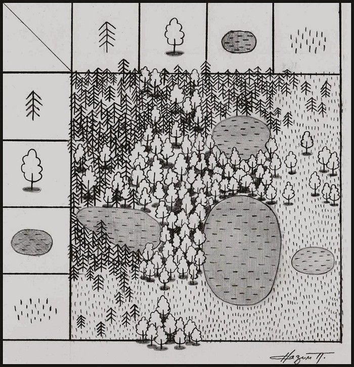

# Referencia visual — Bosque (dirección: low poly verde stylized)

> **Fecha:** 2026-08-01 (actualizado 2026-08-05)
> **Uso:** moodboard y guía de dirección artística para GAME-01.
> **Procedencia:** imagen proporcionada por el usuario; **autoría/licencia del usuario confirmada
> el 2026-08-05** (puede usarse como base de assets).

## Dirección aprobada (2026-08-05)

- **Estilo:** low poly **intermedio-bajo**, **verde stylized muy colorido**.
- **Referencia de estilo:** *Genshin Impact* como referencia visual (cámara libre y
  estilo colorido); **no se incrustan ni se importan assets de ese juego**.
- **Cámara:** libre, movible por el jugador (órbita controlada), como la referencia.
- **Paleta:** verde stylized colorida; sustituye la dirección anterior de tinta monocroma.

## Qué debe conservar la reinterpretación

- Masas de bosque densas y contrastadas frente a claros, agua y terreno.
- Catálogo de símbolos reconocibles: conífera, árbol frondoso, roca, lago y hierba.
- Siluetas legibles a la escala de juego y un foco claro para personajes/jugadores.
- Composición modular que permita construir mapas por piezas sin copiar la imagen.

## Licencia y autoría

- La imagen `bosque-tinta-mapa-2026-08-01.png` es **propiedad del usuario** (autoría/licencia
  confirmada el 2026-08-05); puede usarse como **base de assets** sin restricción externa
  conocida.
- Los assets finales serán derivados originales; no se incrusta la imagen como textura,
  sprite ni tileset literal salvo decisión explícita del usuario.

## Límites de uso

- No usar esta imagen como textura, sprite, tileset ni asset distribuible salvo decisión
  explícita (la licencia es del usuario).
- Genshin Impact es referencia de estilo: no se copian modelos, texturas, nombres ni
  composiciones de ese juego.
- Antes de producir assets finales, documentar autoría/licencia de cada recurso.
- El chrome del OS sigue monocromo; solo el contenido del juego usa la paleta verde stylized.

## Decisiones visuales restantes (preguntar al usuario)

- Escala de cámara, tamaño de avatar y densidad de vegetación.
- Tratamiento de agua, terreno, sombras y capas de profundidad con la nueva paleta.
- Contraste de jugador local, jugadores remotos, selección, colisiones y estados de conexión.
- Modo oscuro y reduced motion (sin movimiento parpadeante).
- Tres assets originales de prueba y un mapa fixture que demuestren el lenguaje visual.
